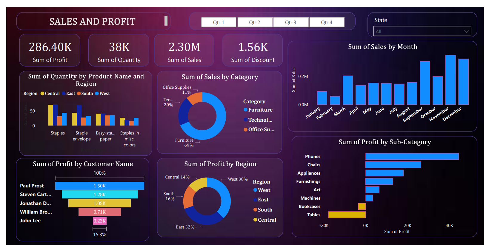

# 💸 Sales and Profit Analysis Dashboard

A Power BI dashboard created to analyze **sales and profit performance** across different categories, regions, and time periods. This dashboard offers insights that can help improve revenue generation and cost control.

## 📊 Dashboard Highlights

- Total Sales and Profit Overview
- Sales by Product and Region
- Monthly Profit Trends
- Top/Bottom Performing Segments

## 🛠 Tools Used

- **Power BI**
- **DAX** (for calculated profit margins, KPIs, etc.)

## 🖼 Dashboard Preview

## 📂 Files Included

- `Sales_Profit_Report.pbix` – Power BI file containing the dashboard
- `sales-profit-dashboard.png` – Dashboard screenshot

---

